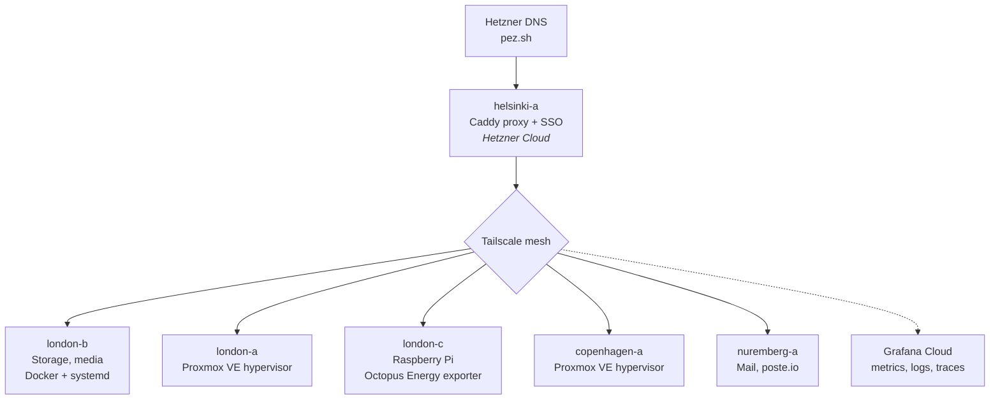

# pez-infra

Infrastructure-as-code monorepo for managing my homelab and cloud server fleet. It contains everything needed to rebuild, configure, and maintain the entire infrastructure from scratch — including server provisioning, service deployment, DNS, monitoring, and secrets management.

## What's in this repo

- **Ansible** — Playbooks, roles, and inventory for configuring servers, deploying Docker-based services, and managing dotfiles
- **Terraform** — OpenTofu/Terraform configs for cloud resources (Hetzner Cloud + DNS, Grafana Cloud, PagerDuty)
- **Services** — Docker Compose definitions and config files for each self-hosted service
- **Documentation** — Architecture decisions, networking topology, and operational guides

## Architecture Overview



DNS (Hetzner DNS for `pez.sh`, managed via Terraform) points directly at a Caddy reverse proxy on a Hetzner cloud instance, which terminates TLS and forwards to backend services running on various hosts connected over a Tailscale mesh network. Authentication for protected services is handled by Authelia with an LLDAP backend. Observability is shipped from every host to Grafana Cloud via Grafana Alloy.

### Hosts

| Host | Location | OS | Role |
|------|----------|-----|------|
| helsinki-a | Hetzner Cloud (Helsinki) | Debian 13 | Reverse proxy (Caddy), SSO (Authelia + LLDAP), Bitwarden, Forgejo |
| london-b | London | Ubuntu 24.04 | Primary storage (ZFS), media servers, *arr stack |
| london-a | London | Debian 13 / Proxmox VE | Hypervisor (currently runs a Mac VM; platform for future VMs) |
| london-c | London | Debian 13 (Raspberry Pi) | Octopus Energy exporter, edge utility box |
| nuremberg-a | Hetzner Cloud (Nuremberg) | Debian 13 | Mail server (poste.io) |
| copenhagen-a | Copenhagen | Debian 12 (Bookworm) / Proxmox VE | Hypervisor (platform for future VMs) |

## Directory Structure

```
├── ansible/        # Ansible playbooks, roles, inventory, and all managed files
│   ├── roles/      # Ansible roles (caddy, docker, media_stack, proxmox_ve, etc.)
│   ├── services/   # Docker Compose definitions and service configs
│   ├── dotfiles/   # Shell config (fish, nvim, tmux, git, etc.)
│   ├── playbooks/  # One-off playbooks (updates, reboots, status)
│   └── scripts/    # Utility and maintenance scripts
├── terraform/      # Terraform/OpenTofu for Hetzner (servers + DNS), Grafana Cloud, PagerDuty
└── docs/           # Architecture, networking, services, monitoring, and per-host docs
```

## Getting Started

### Prerequisites

- SSH access to hosts via Tailscale (all hosts SSH as `root`)
- `ansible` for configuration management
- `tofu` (OpenTofu) or `terraform` for infrastructure provisioning
- `sops` + `age` for editing encrypted secrets

### Usage

1. **Clone:** `git clone git@github.com:RWejlgaard/pez-infra.git`
2. **Services:** Each service has its own directory under `ansible/services/` with a `docker-compose.yml` and config files
3. **Deploy:** `cd ansible && make deploy` runs the unified `deploy.yml` against the whole fleet (or `make deploy-host HOST=<name>`)
4. **Infrastructure:** Terraform configs in `terraform/` manage Hetzner servers + DNS, Grafana Cloud, and PagerDuty

### Secrets

Secrets are encrypted in-repo using [SOPS](https://github.com/getsops/sops) + [age](https://github.com/FiloSottile/age). Encrypted files use `.enc.` in their extension (e.g. `secrets.enc.yaml`). See **[Secrets Management](docs/secrets.md)** for full setup and usage instructions.

## Documentation

Detailed documentation lives in [`docs/`](docs/):

- **[Architecture](docs/architecture.md)** — Network topology, traffic flow, design principles
- **[Networking](docs/networking.md)** — Tailscale mesh, DNS flow (Hetzner DNS), physical networking
- **[Services](docs/services.md)** — Complete service map with ports, auth, and deployment info
- **[Monitoring](docs/monitoring.md)** — Grafana Cloud, Alloy, synthetic checks, PagerDuty
- **[Hosts](docs/hosts/)** — Per-host detail (hardware, services, quirks)
- **[Getting Started](docs/getting-started.md)** — How to work with this repo
