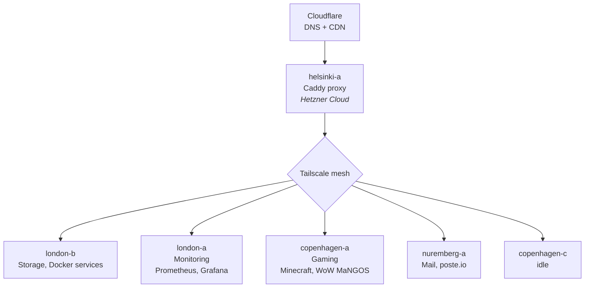

# pez-infra

Infrastructure-as-code monorepo for Pez's homelab and cloud fleet. Everything needed to rebuild, configure, and maintain the server infrastructure from scratch.

## Architecture Overview



### Hosts

| Host | Location | OS | Tailscale IP | Role |
|------|----------|-----|-------------|------|
| helsinki-a | Hetzner Cloud | Linux | 100.67.6.27 | Reverse proxy (Caddy), main traffic gateway |
| london-b | London | Linux | 100.84.65.101 | Primary storage (ZFS), Docker services |
| london-a | London | FreeBSD | 100.122.219.41 | Monitoring (Prometheus, Grafana) |
| nuremberg-a | Hetzner Cloud | Alpine Linux | 100.117.235.28 | Mail server (poste.io) |
| copenhagen-a | Copenhagen | Linux | 100.89.206.60 | Gaming servers (Minecraft, WoW/MaNGOS) |
| copenhagen-c | Copenhagen | Linux | 100.115.45.53 | Idle/available |

### Traffic Flow

1. DNS managed by Cloudflare (Terraform)
2. Traffic routes to helsinki-a (Caddy reverse proxy)
3. Caddy forwards to backend services over Tailscale mesh
4. Auth handled by Authelia with LLDAP backend (on london-b)

## Directory Structure

```
pez-infra/
├── ansible/        # Ansible playbooks, roles, inventory, and all managed files
│   ├── roles/      # Ansible roles (caddy, docker, dotfiles, etc.)
│   ├── services/   # Docker Compose definitions and service configs
│   ├── dotfiles/   # Shell config (fish, nvim, tmux, git, etc.)
│   └── scripts/    # Utility and maintenance scripts
└── terraform/      # Terraform/OpenTofu for Cloudflare, DNS, etc.
```

## Getting Started

### Prerequisites

- SSH access to hosts via Tailscale
- `ansible` for configuration management
- `tofu` (OpenTofu) or `terraform` for infrastructure provisioning
- `gh` CLI for GitHub operations

### Working with this repo

1. **Clone:** `git clone git@github.com:RWejlgaard/pez-infra.git`
2. **Services:** Each service has its own directory under `ansible/services/` with a `docker-compose.yml` and config files
4. **Deploy:** Ansible playbooks in `ansible/` handle deployment (see individual playbook docs)
5. **Infrastructure:** Terraform configs in `terraform/` manage DNS, tunnels, and access policies

### Secrets

Secrets are encrypted in-repo using [SOPS](https://github.com/getsops/sops) + [age](https://github.com/FiloSottile/age). Encrypted files use `.enc.` in their extension (e.g. `secrets.enc.yml`). See **[Secrets Management](docs/secrets.md)** for full setup and usage instructions.

Quick start: `./ansible/scripts/sops-setup.sh`

## Documentation

Comprehensive documentation lives in [`docs/`](docs/):

- **[Architecture](docs/architecture.md)** — Network topology, traffic flow, design principles
- **[Networking](docs/networking.md)** — Tailscale mesh, DNS flow, physical networking
- **[Services](docs/services.md)** — Complete service map with ports, auth, and deployment info
- **[Monitoring](docs/monitoring.md)** — Prometheus, Grafana, exporters, status page
- **[Getting Started](docs/getting-started.md)** — How to work with this repo

## Consolidated Repos

This monorepo replaces several standalone repos:

- `pez-ansible` → `ansible/`
- `pez-terraform` → `terraform/`
- `pez-grafana` → `services/grafana/`
- `pez-proxy` → `services/caddy/`
- `pez-docs` → `docs/` and per-host documentation
- `server-scripts` → `scripts/` and `ansible/`
