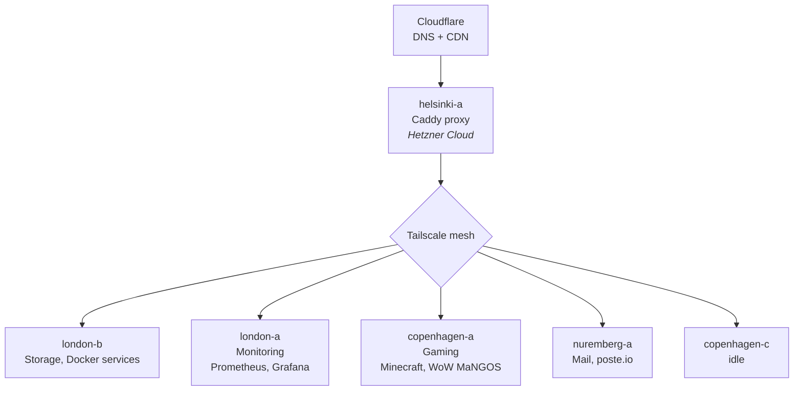

# pez-infra

Infrastructure-as-code monorepo for managing my homelab and cloud server fleet. It contains everything needed to rebuild, configure, and maintain the entire infrastructure from scratch — including server provisioning, service deployment, DNS, monitoring, and secrets management.

## What's in this repo

- **Ansible** — Playbooks, roles, and inventory for configuring servers, deploying Docker-based services, and managing dotfiles
- **Terraform** — OpenTofu/Terraform configs for cloud resources (Cloudflare DNS, Hetzner servers)
- **Services** — Docker Compose definitions and config files for each self-hosted service
- **Documentation** — Architecture decisions, networking topology, and operational guides

## Architecture Overview



Traffic enters via Cloudflare DNS, hits a Caddy reverse proxy on a Hetzner cloud instance, and is forwarded to backend services running on various hosts connected over a Tailscale mesh network. Authentication is handled by Authelia with an LLDAP backend.

### Hosts

| Host | Location | OS | Role |
|------|----------|-----|------|
| helsinki-a | Hetzner Cloud | Linux | Reverse proxy (Caddy), main traffic gateway |
| london-b | London | Linux | Primary storage (ZFS), Docker services |
| london-a | London | FreeBSD | Monitoring (Prometheus, Grafana) |
| nuremberg-a | Hetzner Cloud | Alpine Linux | Mail server (poste.io) |
| copenhagen-a | Copenhagen | Linux | Gaming servers (Minecraft, WoW/MaNGOS) |
| copenhagen-c | Copenhagen | Linux | Idle/available |

## Directory Structure

```
├── ansible/        # Ansible playbooks, roles, inventory, and all managed files
│   ├── roles/      # Ansible roles (caddy, docker, dotfiles, etc.)
│   ├── services/   # Docker Compose definitions and service configs
│   ├── dotfiles/   # Shell config (fish, nvim, tmux, git, etc.)
│   └── scripts/    # Utility and maintenance scripts
├── terraform/      # Terraform/OpenTofu for Cloudflare DNS, Hetzner servers
└── docs/           # Architecture, networking, services, and monitoring docs
```

## Getting Started

### Prerequisites

- SSH access to hosts via Tailscale
- `ansible` for configuration management
- `tofu` (OpenTofu) or `terraform` for infrastructure provisioning

### Usage

1. **Clone:** `git clone git@github.com:RWejlgaard/pez-infra.git`
2. **Services:** Each service has its own directory under `ansible/services/` with a `docker-compose.yml` and config files
3. **Deploy:** Ansible playbooks in `ansible/` handle deployment (see individual playbook docs)
4. **Infrastructure:** Terraform configs in `terraform/` manage DNS and cloud resources

### Secrets

Secrets are encrypted in-repo using [SOPS](https://github.com/getsops/sops) + [age](https://github.com/FiloSottile/age). Encrypted files use `.enc.` in their extension (e.g. `secrets.enc.yml`). See **[Secrets Management](docs/secrets.md)** for full setup and usage instructions.

## Documentation

Detailed documentation lives in [`docs/`](docs/):

- **[Architecture](docs/architecture.md)** — Network topology, traffic flow, design principles
- **[Networking](docs/networking.md)** — Tailscale mesh, DNS flow, physical networking
- **[Services](docs/services.md)** — Complete service map with ports, auth, and deployment info
- **[Monitoring](docs/monitoring.md)** — Prometheus, Grafana, exporters, status page
- **[Getting Started](docs/getting-started.md)** — How to work with this repo
