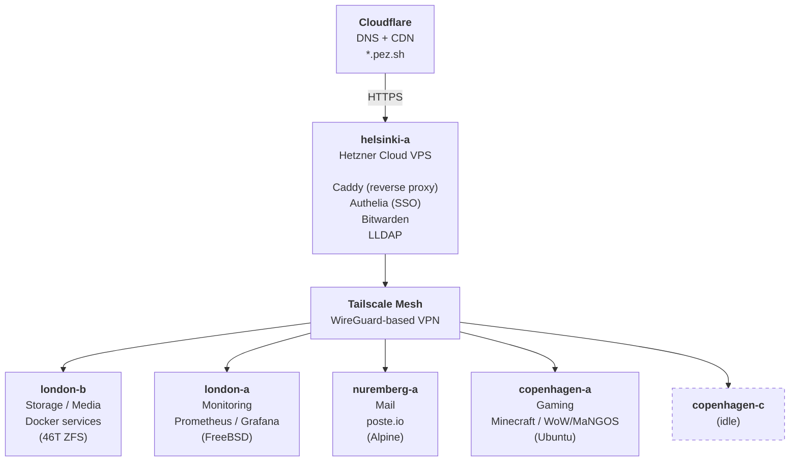
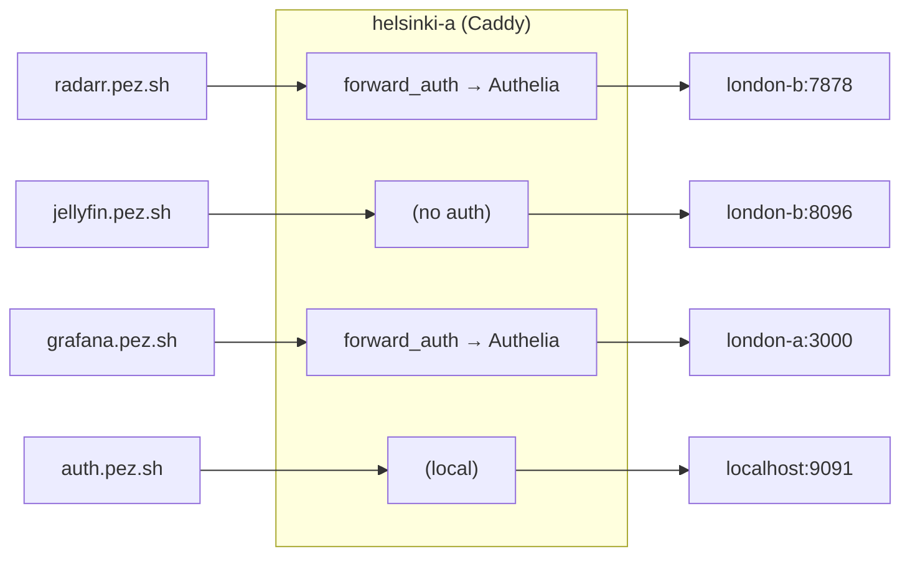
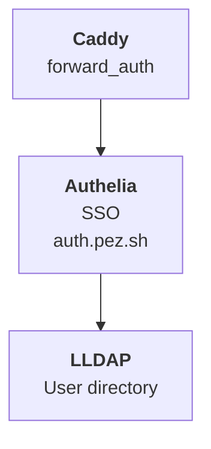

# Architecture

## Overview

The infrastructure spans four physical locations connected by a Tailscale mesh network. All public traffic enters through a single Hetzner Cloud VPS (helsinki-a) running Caddy as a reverse proxy, which forwards requests over Tailscale to backend services running on physical servers in London and Copenhagen.

The setup is entirely self-hosted (with the exception of Hetzner Cloud VPSs and Cloudflare for DNS/CDN). Servers are old personal computers repurposed into server duty — cheaper than cloud, and I get a rack cabinet that doubles as a bedroom white noise machine.

## Network Topology



## Traffic Flow

All public-facing services follow the same pattern:

```
User → Cloudflare (DNS + TLS) → helsinki-a (Caddy) → Backend (over Tailscale)
```

1. DNS for `*.pez.sh` is managed by Cloudflare (provisioned via Terraform)
2. Cloudflare proxies traffic to helsinki-a
3. Caddy on helsinki-a terminates TLS and routes to the correct backend
4. For protected services, Caddy calls Authelia first (`forward_auth`)
5. If authenticated (or no auth required), traffic is proxied over Tailscale to the backend



## Auth Architecture



Authelia authenticates against LLDAP (both on helsinki-a). One place to manage users — add or remove someone in LDAP and it propagates to all protected services.

Services with their own auth (Bitwarden, Jellyfin, Plex, Nextcloud, Navidrome, Jellyseerr) are not behind Authelia.

## Design Principles

- **Self-hosted first.** Cloud VPSs only where it makes sense (public gateway, mail with clean IP reputation). Everything else runs on physical hardware I own.
- **Tailscale as the backbone.** No ports exposed on residential IPs. All inter-server communication goes over the mesh.
- **Ansible for everything.** If a server dies, reinstall the OS, install Tailscale, run Ansible. 30 minutes to full recovery.
- **Terraform for DNS.** All Cloudflare records are in code. No clicking around in dashboards.
- **Cattle, not pets (as much as possible).** The servers are technically pets — old hardware in specific locations — but the configs are cattle. Everything is reproducible from this repo.
