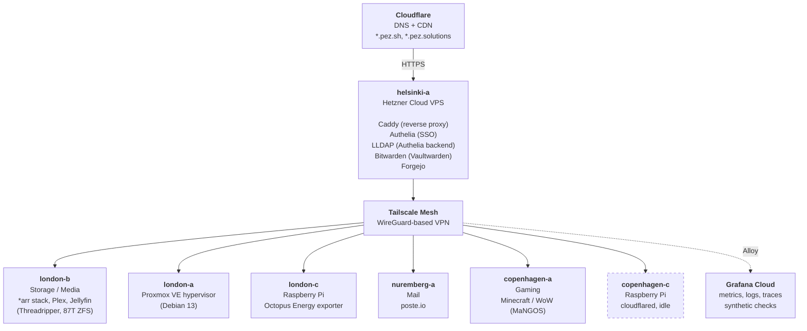
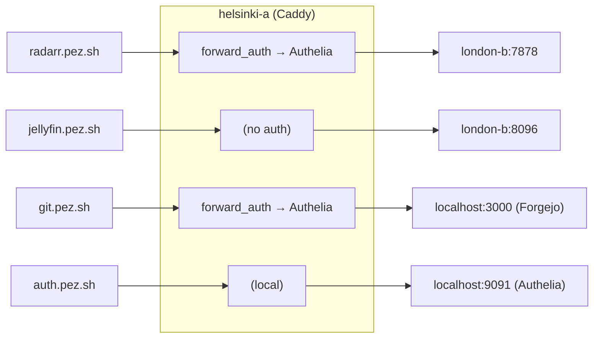
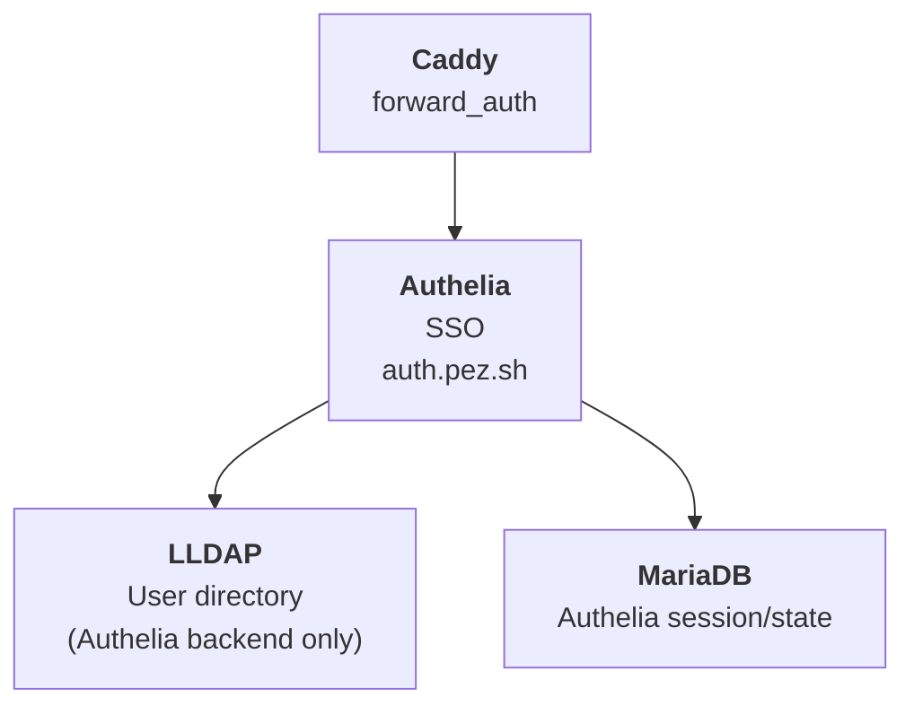

# Architecture

## Overview

The infrastructure spans three physical locations (London, Copenhagen, Hetzner Cloud) connected by a Tailscale mesh network. All public traffic enters through a single Hetzner Cloud VPS (helsinki-a) running Caddy as a reverse proxy, which forwards requests over Tailscale to backend services running on physical servers in London and Copenhagen.

The setup is entirely self-hosted (with the exception of Hetzner Cloud VPSs, Cloudflare for DNS/CDN, and Grafana Cloud for observability). Most physical servers are old personal computers repurposed into server duty — cheaper than cloud, and I get a rack cabinet that doubles as a bedroom white noise machine.

## Network Topology



## Traffic Flow

All public-facing services follow the same pattern:

```
User → Cloudflare (DNS + TLS) → helsinki-a (Caddy) → Backend (over Tailscale)
```

1. DNS for `pez.sh` and `pez.solutions` is managed by Cloudflare (provisioned via Terraform)
2. Cloudflare proxies traffic to helsinki-a
3. Caddy on helsinki-a terminates TLS and routes to the correct backend
4. For protected services, Caddy calls Authelia first (`forward_auth`)
5. If authenticated (or no auth required), traffic is proxied over Tailscale to the backend



## Auth Architecture



Authelia authenticates against LLDAP and uses a MariaDB for session/state. All three run as Docker containers on helsinki-a. LLDAP is **not** wired into other apps — it's purely Authelia's user backend. Services that sit behind Authelia inherit users from LLDAP via the Caddy `forward_auth` flow; services with their own auth (Bitwarden, Plex, Jellyfin, Navidrome, Jellyseerr, Forgejo, poste.io) maintain their own user databases.

## Observability

Metrics, logs, and traces ship to **Grafana Cloud** from every host via **Grafana Alloy**. The Alloy collectors are registered in Grafana Fleet Management (configured in `terraform/grafana/`). Synthetic uptime checks for the public sites run from Grafana Cloud probes, and PagerDuty handles alert delivery.

> **History:** Monitoring used to run locally on london-a (FreeBSD, with Prometheus + Grafana). london-a has since been wiped and reinstalled as Proxmox VE; the local stack was retired in favour of Grafana Cloud. See [monitoring.md](monitoring.md) for the current setup.

## Design Principles

- **Self-hosted first.** Cloud VPSs only where it makes sense (public gateway, mail with clean IP reputation). Everything else runs on physical hardware I own.
- **Tailscale as the backbone.** No ports exposed on residential IPs. All inter-server communication goes over the mesh.
- **Ansible for everything.** If a server dies, reinstall the OS, install Tailscale, run `make deploy`. Roughly 30 minutes to full recovery.
- **Terraform for cloud + DNS.** Hetzner servers, Cloudflare records, Grafana Cloud configuration, and PagerDuty are all in code. No clicking around in dashboards.
- **Cattle, not pets (as much as possible).** The servers are technically pets — old hardware in specific locations — but the configs are cattle. Everything is reproducible from this repo.
