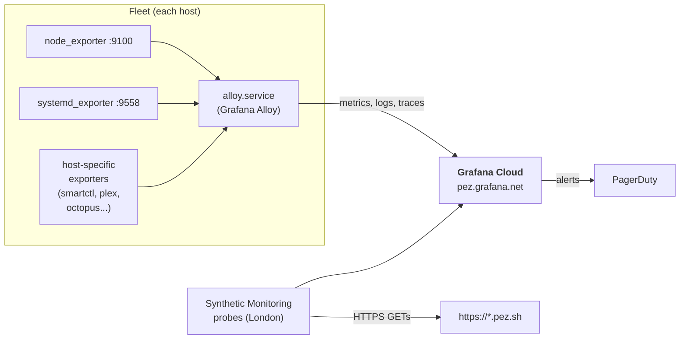

# Monitoring

## Stack Overview

Observability is a fully managed pipeline today: every host runs **Grafana Alloy** as the local collector, and everything ships to **Grafana Cloud**. Synthetic checks are also driven from Grafana Cloud, and alerts are routed to **PagerDuty**.

Everything in `terraform/grafana/` is the source of truth for the Grafana Cloud side: stack, Fleet Management collectors, fleet pipelines, dashboards, and synthetic checks. Everything in `terraform/pagerduty/` configures the on-call destination.

## Grafana Alloy (per-host collector)

Alloy runs as `alloy.service` on every host in the inventory. Each host is registered as a Grafana Fleet Management collector in `terraform/grafana/fleet_collectors.tf`, tagged with a `location` attribute (`london`, `copenhagen`, `cloud`) so pipelines can target subsets of the fleet.

Pipelines (what to scrape, how to relabel, where to ship) live in `terraform/grafana/fleet_pipelines/` and are pushed to Grafana Cloud as a `grafana_fleet_management_pipeline` resource. The Alloy daemons on each host pull their config from Fleet Management.

The `common` role drops a `10-resilience.conf` systemd override onto every host (`StartLimitIntervalSec=0`, `Restart=always`, `RestartSec=30`) so a transient upstream/TLS failure can't trip systemd's start rate-limit and permanently kill the collector — it keeps retrying until Grafana Cloud is reachable again. (Added after copenhagen-c sat unmonitored for ~2.5 weeks following one such blip — PESO-149.)

### Local exporters scraped by Alloy

| Exporter | Hosts | What |
|---|---|---|
| node_exporter | All hosts | CPU, memory, disk, network, system uptime |
| systemd_exporter | All hosts | Per-unit systemd state |
| smartctl_exporter (Docker) | london-b, copenhagen-a | Disk SMART data |
| prom-plex-exporter (Docker) | london-b | Plex streaming activity |
| octopus_exporter (Docker) | london-c | Octopus Energy electricity usage |
| Caddy `/metrics` | helsinki-a | HTTP request metrics, upstream health (per host) |

### Logs

Alloy ships systemd journal entries from every host to Grafana Cloud Logs. Log-derived alerts (e.g. SSH brute-force, mail server errors) can be configured directly in Grafana Cloud.

## Synthetic Monitoring

Grafana Cloud's Synthetic Monitoring service runs HTTPS probes from the London region against the public services, every 10 minutes. Configured in `terraform/grafana/synthetic_checks.tf`:

| Check | URL |
|---|---|
| pez_sh | https://pez.sh |
| pez_solutions | https://pez.solutions |
| jellyfin | https://jellyfin.pez.sh |
| plex | https://plex.pez.sh (auth header) |
| request | https://request.pez.sh |
| jellyfin_requests | https://jellyfin-requests.pez.sh |
| git | https://git.pez.sh |

Each check has a `ProbeFailedExecutionsTooHigh` alert wired up (3 failed executions in a 30-minute window).

## Alerting → PagerDuty

PagerDuty is configured in `terraform/pagerduty/`:

- A single service (`pez-infra`) receives alerts
- Escalation policy fires to me directly
- The Grafana Cloud → PagerDuty integration sends every fired alert (synthetic check failures today; can be extended to log/metric alerts)

## Status Page

**status.pez.sh** is a public status page hosted on helsinki-a at `/srv/status`.

- Cron-driven static JSON (see `ansible/roles/status_page/`) — does not require Grafana Cloud to render
- Hosted directly by Caddy as a `file_server`
- Public by design (no Authelia)
- Source repo for the front-end: [RWejlgaard/pez-status](https://github.com/RWejlgaard/pez-status)

## History

Monitoring used to run locally on **london-a** (FreeBSD) with a self-hosted Prometheus + Grafana. When london-a was reinstalled as Proxmox VE, the local stack was retired and everything moved to Grafana Cloud + Alloy. Older docs (and a few legacy hard-coded IPs in helper scripts) may still reference `100.122.219.41:9090` — that endpoint no longer exists.
