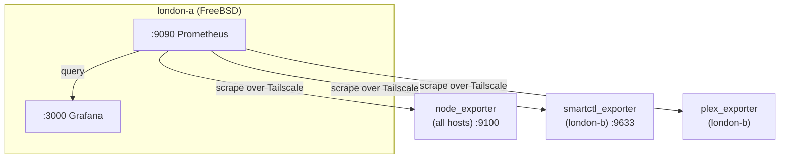

# Monitoring

## Stack Overview

Both Prometheus and Grafana are accessible via:
- **grafana.pez.sh** (behind Authelia)
- **prometheus.pez.sh** (behind Authelia)

## Prometheus

Prometheus runs on london-a and scrapes metrics from exporters across the fleet. All scrape targets are reached over Tailscale — no ports need to be exposed on the public internet.

### Scrape Targets

| Target | Host | Port | What |
|--------|------|------|------|
| node_exporter | All hosts | 9100 | System metrics (CPU, memory, disk, network) |
| smartctl_exporter | london-b | 9633 | Disk SMART health data |
| prom-plex-exporter | london-b | (varies) | Plex streaming activity |

node_exporter is deployed to every host via Ansible. It's one of the first things that gets installed on a new server.

### Adding a scrape target

1. Deploy the exporter to the host (via Ansible or Docker)
2. Add the target to the Prometheus config in `services/prometheus/`
3. Deploy the updated config (Ansible or manual restart)
4. Verify it shows up in Prometheus targets page

## Grafana

Grafana reads from Prometheus and provides dashboards for everything worth watching.

### Dashboards

| Dashboard | What it shows |
|-----------|--------------|
| Server Health | CPU, memory, disk usage, network I/O across all hosts |
| ZFS | Pool status, usage, scrub results for london-b |
| SMART | Disk health metrics, temperature, error counts |
| Plex | Active streams, transcoding status, library stats |

### Adding a dashboard

Dashboards are defined in `services/grafana/`. Export as JSON from Grafana and commit to the repo to keep them in version control.

## Exporters

### node_exporter

Standard Prometheus node exporter. Deployed on every host. Provides system-level metrics:
- CPU usage and load averages
- Memory usage
- Disk space and I/O
- Network traffic
- System uptime

Installed via Ansible as part of the base server setup.

### smartctl_exporter

Runs on london-b (the ZFS storage server with 8 spinning disks). Exposes SMART data from all drives:
- Temperature
- Reallocated sectors
- Read/write error rates
- Power-on hours
- Overall health assessment

Critical for catching dying drives before they take out a RAIDZ1 vdev.

### prom-plex-exporter

Runs on london-b. Scrapes the Plex API and exposes metrics about:
- Active streams
- Transcode sessions
- Library size
- User activity

Mostly for fun — it's satisfying to see the Plex dashboard light up when people are streaming.

## Status Page

**status.pez.sh** is a lightweight public status page that shows service availability.

- Pulls availability data from Prometheus
- Shows 90-day uptime history
- Hosted on helsinki-a at `/srv/status`
- Source: [RWejlgaard/pez-status](https://github.com/RWejlgaard/pez-status)
- Not behind Authelia — it's public by design

## Alerting

Prometheus alerting rules can be configured in the Prometheus config. Alert conditions worth monitoring:

- Host down (node_exporter unreachable)
- Disk space critical (>90% usage)
- ZFS scrub errors
- SMART drive failures
- High memory usage

Grafana can also be configured with alert channels (email, webhooks, etc.) for dashboard-based alerts.
