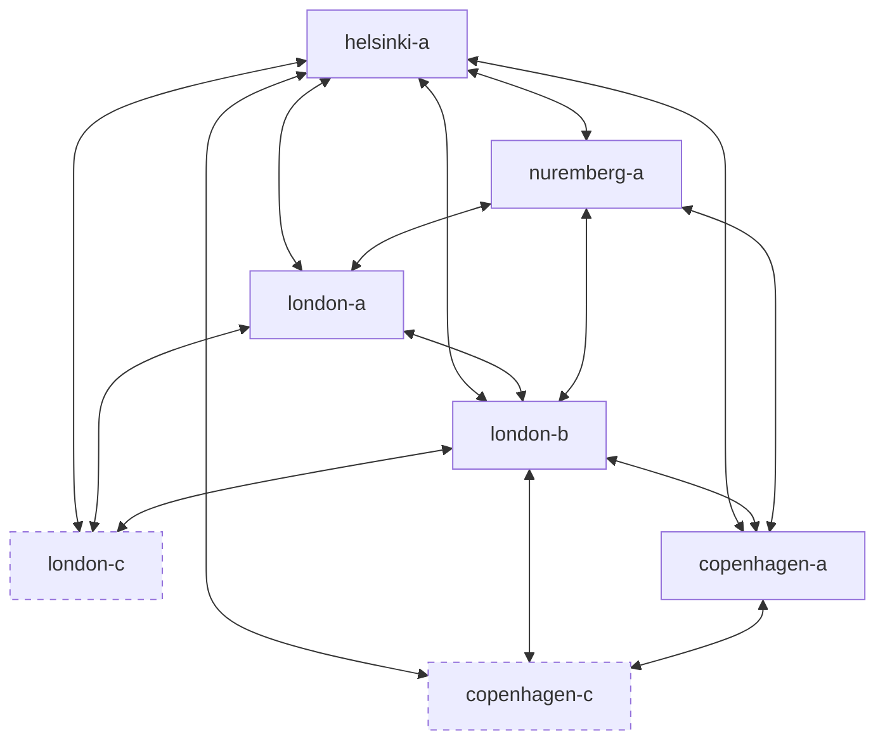
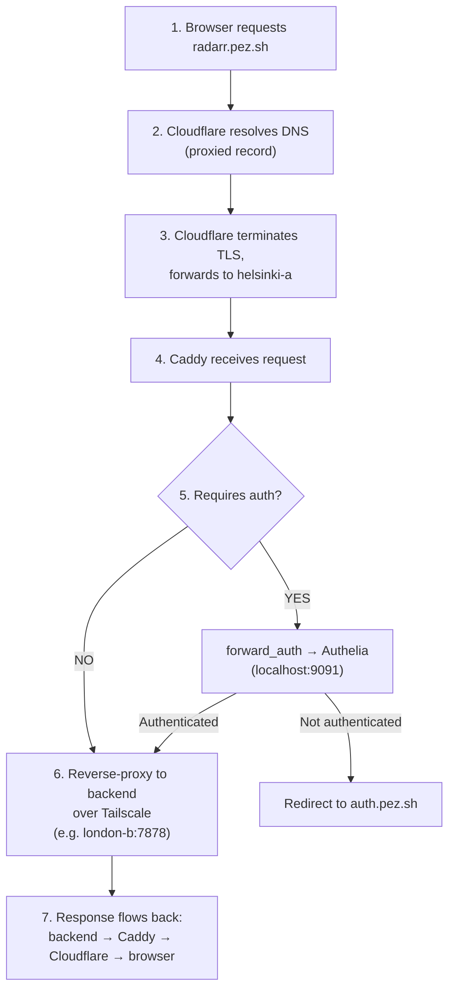

# Networking

## Tailscale Mesh

Tailscale is the backbone of the whole setup. It's a WireGuard-based mesh VPN that connects all servers regardless of where they physically are. Every server can reach every other server directly — no port forwarding, no NAT traversal, no exposed SSH ports.

All inter-server communication uses Tailscale IPs:

| Host | Tailscale IP |
|------|-------------|
| helsinki-a | 100.67.6.27 |
| london-a | 100.122.180.98 |
| london-b | 100.84.65.101 |
| london-c | 100.123.72.87 |
| nuremberg-a | 100.70.180.24 |
| copenhagen-a | 100.89.206.60 |
| copenhagen-c | 100.115.45.53 |

### What Tailscale is used for

- **Reverse proxying:** Caddy on helsinki-a forwards traffic to backends via Tailscale IPs
- **Observability:** Grafana Alloy on each host pushes metrics/logs/traces to Grafana Cloud; intra-fleet probes (e.g. Proxmox UI) hop over Tailscale
- **SSH access:** All SSH is done over Tailscale — no SSH ports exposed to the internet
- **Ansible deployments:** GitHub Actions runs Ansible over Tailscale SSH connections
- **Exit nodes:** Servers can act as VPN endpoints — useful for accessing UK content from Copenhagen or vice versa

### Mesh Diagram



> Every node can reach every other node directly. The mesh is fully connected.

## Physical Networking

### London

The London setup is in a rack cabinet in the bedroom (great white noise machine, honestly).

- **Router:** Ubiquiti Dream Machine Special Edition — overkill for a home setup but gives excellent routing performance vs an ISP router
- **ISP:** BT, 1 Gbit down / 300 Mbit up, ~£90/month
- **Cabling:** Cat 5 in the walls, patch panel in the utility closet, connected to a Ubiquiti switch
- **Servers:** london-a, london-b, and london-c all wired into the Ubiquiti switch (london-c is a Raspberry Pi running over Ethernet)

### Copenhagen

A stack of servers at my dad's place — acts as an off-site location.

- **Router:** ISP-provided (not my house, can't exactly install a Ubiquiti rack)
- **ISP:** Symmetrical 500 Mbit — plenty for what's running there
- **Servers:** copenhagen-a (Lenovo tiny desktop) and copenhagen-c (Raspberry Pi) connected directly to the ISP router's built-in switch

### Helsinki / Nuremberg (Hetzner Cloud)

- Standard Hetzner Cloud VPS networking
- Public IPv4 addresses, managed via the `terraform/hetzner/` module
- helsinki-a is the only server that receives general HTTP/HTTPS traffic from the public internet
- nuremberg-a receives mail (ports 25, 465, 587, 993, 995)

## DNS Flow

All DNS is managed by Cloudflare, provisioned via Terraform.

### Domains

- **pez.sh** — primary domain. Registered on Hover.com with nameservers pointed to Cloudflare.
- **pez.solutions** — alternate domain. Most services that have a `*.pez.sh` host also accept the matching `*.pez.solutions` host, so apps remain reachable if one TLD has trouble.

### How a request reaches a service



### Public Subdomains

All subdomains are Cloudflare-proxied and terminate at helsinki-a. Hosts marked with both `pez.sh` and `pez.solutions` are reachable on either TLD.

| Subdomain | Backend | Auth |
|---|---|---|
| auth.pez.sh / auth.pez.solutions | helsinki-a:9091 (Authelia) | — |
| bitwarden.pez.sh | helsinki-a:8443 (Vaultwarden) | Own auth |
| git.pez.sh | helsinki-a:3000 (Forgejo) | Own auth |
| ldap.pez.sh | helsinki-a:17170 (LLDAP web UI) | LLDAP login |
| status.pez.sh | helsinki-a:/srv/status (static) | — |
| apps.pez.sh / apps.pez.solutions | helsinki-a:/srv/apps (static dashboard) | Authelia |
| pez.sh | helsinki-a:/srv/pez.sh (static) | — |
| pez.solutions | helsinki-a:/srv/pez.solutions (static) | — |
| signup.pez.solutions | helsinki-a:/srv/pez-signup (static) | — |
| london-a.pez.sh | london-a:8006 (Proxmox UI) | Proxmox login |
| jellyfin.pez.sh / .solutions | london-b:8096 | Own auth |
| plex.pez.sh / .solutions | london-b:32400 | Own auth |
| music.pez.sh | london-b:4533 (Navidrome) | Own auth |
| rss.pez.sh | london-b:8181 (Miniflux) | Authelia |
| request.pez.sh / .solutions | london-b:5055 (Jellyseerr) | Own auth |
| jellyfin-requests.pez.sh / .solutions | london-b:5056 (Overseerr) | Own auth |
| radarr.pez.sh / .solutions | london-b:7878 | Authelia |
| sonarr.pez.sh / .solutions | london-b:8989 | Authelia |
| lidarr.pez.sh / .solutions | london-b:8686 | Authelia |
| readarr.pez.sh / .solutions | london-b:8787 | Authelia |
| prowlarr.pez.sh / .solutions | london-b:9696 | Authelia |
| soulseek.pez.sh / .solutions | london-b:5030 (slskd) | Authelia |
| download.pez.sh / .solutions | london-b:9091 (Transmission) | Authelia |

### Mail DNS

nuremberg-a handles mail for pez.sh. DNS records managed via Cloudflare:

- **MX** record pointing to nuremberg-a
- **SPF** record for sender verification
- **DKIM** record for message signing
- **DMARC** record for policy enforcement

### Caddy TLS

Caddy handles TLS termination for the Cloudflare-to-origin connection. Certificates are obtained and renewed automatically via ACME (Let's Encrypt). No manual cert management, no cron jobs, no renewals to think about.

Example Caddyfile block for a protected service:

```caddyfile
radarr.pez.sh {
    forward_auth localhost:9091 {
        uri /api/authz/forward-auth
        copy_headers Remote-User Remote-Groups Remote-Name Remote-Email
    }
    reverse_proxy 100.84.65.101:7878
}
```

Compare that to the equivalent Nginx config — about 4 lines vs 20. This is why I use Caddy.
