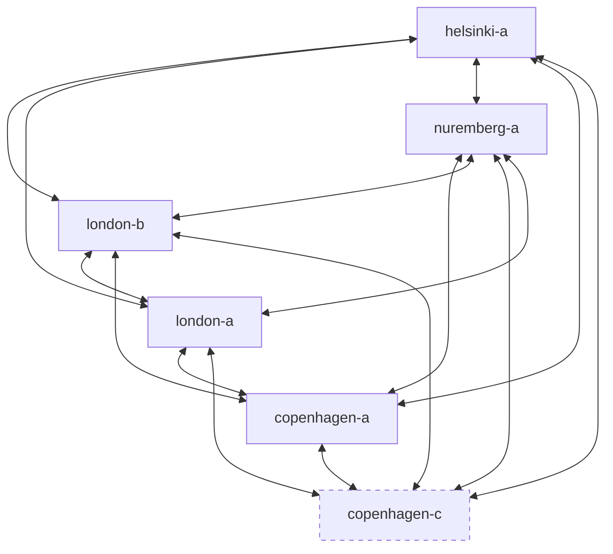
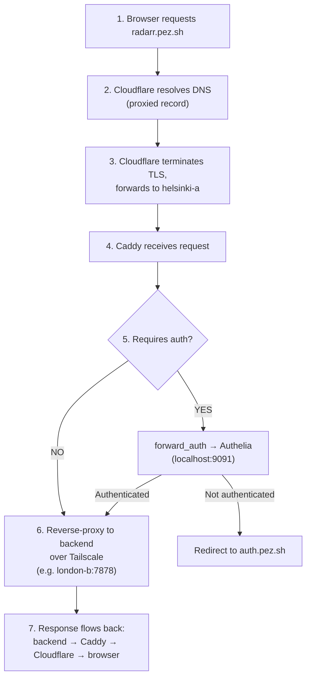

# Networking

## Tailscale Mesh

Tailscale is the backbone of the whole setup. It's a WireGuard-based mesh VPN that connects all servers regardless of where they physically are. Every server can reach every other server directly — no port forwarding, no NAT traversal, no exposed SSH ports.

All inter-server communication uses Tailscale IPs:

| Host | Tailscale IP |
|------|-------------|
| helsinki-a | 100.67.6.27 |
| london-b | 100.84.65.101 |
| london-a | 100.122.219.41 |
| nuremberg-a | 100.117.235.28 |
| copenhagen-a | 100.89.206.60 |
| copenhagen-c | 100.115.45.53 |

### What Tailscale is used for

- **Reverse proxying:** Caddy on helsinki-a forwards traffic to backends via Tailscale IPs
- **Monitoring:** Prometheus on london-a scrapes exporters on all hosts via Tailscale
- **SSH access:** All SSH is done over Tailscale — no SSH ports exposed to the internet
- **Ansible deployments:** GitHub Actions runs Ansible over Tailscale SSH connections
- **Exit nodes:** Servers can act as VPN endpoints — useful for accessing UK content from Copenhagen or vice versa

### Mesh Diagram



> Every node can reach every other node directly. The mesh is fully connected.

## Physical Networking

### London

The London setup is in a rack cabinet in the bedroom (great white noise machine, honestly).

- **Router:** Ubiquiti Dream Machine Special Edition — overkill for a home setup but gives excellent routing performance vs an ISP router
- **ISP:** BT, 1 Gbit down / 300 Mbit up, ~£90/month
- **Cabling:** Cat 5 in the walls, patch panel in the utility closet, connected to a Ubiquiti switch
- **Servers:** london-a and london-b connected via Ethernet to the switch

### Copenhagen

A stack of servers at my dad's place — acts as an off-site location.

- **Router:** ISP-provided (not my house, can't exactly install a Ubiquiti rack)
- **ISP:** Symmetrical 500 Mbit — plenty for what's running there
- **Servers:** copenhagen-a and copenhagen-c connected directly to the ISP router's built-in switch

### Helsinki / Nuremberg (Hetzner Cloud)

- Standard Hetzner Cloud VPS networking
- Public IPv4 addresses
- helsinki-a is the only server that receives traffic from the public internet
- nuremberg-a receives mail (ports 25, 587, 993)

## DNS Flow

All DNS is managed by Cloudflare, provisioned via Terraform.

### Domain: pez.sh

The domain is registered on Hover.com with nameservers pointed to Cloudflare.

### How a request reaches a service



### Public Subdomains

All subdomains are Cloudflare-proxied and terminate at helsinki-a:

| Subdomain | Backend | Auth |
|---|---|---|
| auth.pez.sh | helsinki-a:9091 | — |
| bitwarden.pez.sh | helsinki-a:8443 | — |
| status.pez.sh | helsinki-a:/srv/status | — |
| apps.pez.sh | helsinki-a:/srv/apps | Authelia |
| grafana.pez.sh | london-a:3000 | Authelia |
| prometheus.pez.sh | london-a:9090 | Authelia |
| jellyfin.pez.sh | london-b:8096 | — |
| plex.pez.sh | london-b:32400 | — |
| request.pez.sh | london-b:5055 | — |
| cloud.pez.sh | london-b:11000 | — |
| music.pez.sh | london-b:4533 | — |
| radarr.pez.sh | london-b:7878 | Authelia |
| sonarr.pez.sh | london-b:8989 | Authelia |
| lidarr.pez.sh | london-b:8686 | Authelia |
| readarr.pez.sh | london-b:8787 | Authelia |
| prowlarr.pez.sh | london-b:9696 | Authelia |
| soulseek.pez.sh | london-b:5030 | Authelia |
| download.pez.sh | london-b:9091 | Authelia |

### Mail DNS

nuremberg-a handles mail for pez.sh. DNS records managed via Cloudflare:

- **MX** record pointing to nuremberg-a
- **SPF** record for sender verification
- **DKIM** record for message signing
- **DMARC** record for policy enforcement

### Caddy TLS

Caddy handles TLS termination for the Cloudflare-to-origin connection. Certificates are obtained and renewed automatically via ACME (Let's Encrypt). No manual cert management, no cron jobs, no renewals to think about.

Example Caddyfile block for a protected service:

```
radarr.pez.sh {
    forward_auth helsinki-a:9091 {
        uri /api/verify?rd=https://auth.pez.sh
        copy_headers Remote-User Remote-Groups Remote-Name Remote-Email
    }
    reverse_proxy london-b:7878
}
```

Compare that to the equivalent Nginx config — about 4 lines vs 20. This is why I use Caddy.
